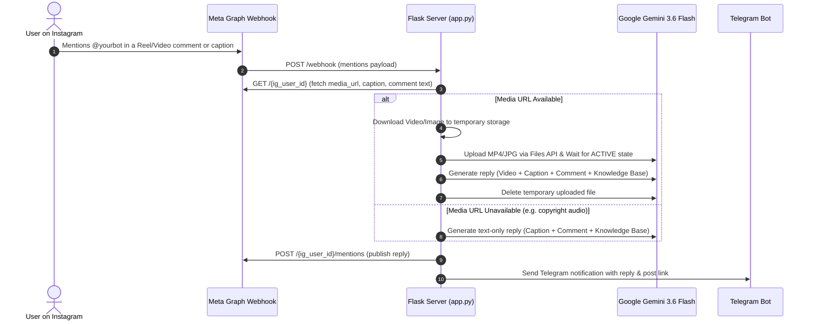

# Instagram Multimodal Mention-Reply Bot (Reels, Videos & Photos)

Watches for @mentions of your Instagram Business/Creator account under **other people's posts and Reels** (in captions or comments), downloads and **watches/analyzes the video or image content** using Google Gemini's multimodal AI, drafts an authentic contextual reply, publishes it via Instagram's official Mentions API, and notifies you on Telegram.

---

## Why Google Gemini API vs. Grok / Groq?

| Feature | **Google Gemini API (`gemini-3.6-flash`)** | **Groq API** | **xAI Grok** |
| :--- | :--- | :--- | :--- |
| **Native Video Processing** | ✅ **Native Video & Audio Understanding** (Direct MP4/MOV upload; reads video frames, dialogue, gestures, text overlays) | ❌ **No Video Support** (Images & Whisper audio only; cannot process video files directly) | ❌ **No Video Support** (Multi-image vision only; no video upload API) |
| **Free Tier** | ✅ **100% Free** via Google AI Studio (No credit card required; 15 RPM, 1M tokens/min, 1,500 requests/day) | ✅ Free tier for text & Whisper, but lacks video multimodal models | ❌ **Paid only** (Requires pre-paid credits) |
| **Files API** | ✅ Uploads media up to 2GB with server-side processing & automated cleanup | ❌ N/A | ❌ N/A |
| **Recommendation** | 🏆 **Best & Only Viable Free Choice for Video** | Great for pure text, not video | Not suitable |

---

## How It Works



---

## Prerequisites

1. **Instagram Business or Creator Account** (Settings → Account type and tools → Switch to Professional Account).
2. Linked to a **Facebook Page** where you are an admin.
3. A **Meta Developer Account & App** at [developers.facebook.com](https://developers.facebook.com) ("Business" type) with the **Instagram Graph API** product added.
4. A free **Gemini API Key** from [Google AI Studio](https://aistudio.google.com/apikey) (no credit card needed).
5. A **Telegram Bot** created via [@BotFather](https://t.me/BotFather) and your chat ID.

---

## Setup Walkthrough

### 1. Meta Developer App & Token Setup
1. Go to [developers.facebook.com](https://developers.facebook.com) → **My Apps** → **Create App** → choose **Business**.
2. Add the **Instagram Graph API** product.
3. Copy **App ID** and **App Secret** (`META_APP_SECRET`) from **App Settings → Basic**.
4. In [Graph API Explorer](https://developers.facebook.com/tools/explorer):
   - Select your app, click **Get Token** → **Get User Access Token**.
   - Select permissions: `instagram_basic`, `instagram_manage_comments`, `pages_show_list`, `pages_read_engagement`.
   - Run `GET /me/accounts` to get your Page Access Token.
   - Run `GET /{page-id}?fields=instagram_business_account` to get your `IG_USER_ID`.
   - Exchange the token for a 60-day long-lived token via Meta's OAuth endpoint, then copy it to `IG_ACCESS_TOKEN`.

### 2. Google Gemini API Key
1. Visit [aistudio.google.com/apikey](https://aistudio.google.com/apikey).
2. Create a free API key and set it as `GEMINI_API_KEY` in `.env`.
3. The default model is `gemini-3.6-flash` (or `gemini-3.7-flash`), which is optimized for fast multimodal video reasoning.

### 3. Telegram Notifications
1. Message [@BotFather](https://t.me/BotFather) → `/newbot` → copy the token into `TELEGRAM_BOT_TOKEN`.
2. Message your bot anything, then visit `https://api.telegram.org/bot<TOKEN>/getUpdates` to get your numeric `chat.id` (`TELEGRAM_CHAT_ID`).

### 4. Custom Knowledge Base (Optional)
- Edit `knowledge_base.txt` to add your own brand facts, FAQs, and tone guidelines. The bot will strictly follow this dataset when crafting replies.

### 5. Local Run & Webhook Testing
```bash
# 1. Install dependencies
pip install -r requirements.txt

# 2. Copy and configure .env
cp .env.example .env

# 3. Start the Flask server
python app.py

# 4. In a separate terminal, expose port 8000 via ngrok
ngrok http 8000
```

### 6. Register Webhook with Meta
1. Go to your Meta App Dashboard → **Webhooks** → select **Instagram**.
2. Set Callback URL to `https://<your-ngrok-url>/webhook` and Verify Token to your `WEBHOOK_VERIFY_TOKEN`.
3. Click **Verify and Save**, then subscribe to the **`mentions`** field.

---

## Important Media & API Limitations

- **Copyrighted / Licensed Music on Reels**: Meta's Graph API automatically omits `media_url` for Reels containing licensed commercial audio or where the post owner has disabled Reel downloads.
  - **Graceful Fallback**: The bot detects this and automatically falls back to analyzing the post caption + user comment text without failing.
- **Stories**: Mentions on Instagram Stories are not supported by the Mentions API.
- **Private Accounts**: Webhooks will not trigger for mentions from private accounts.
- **Tagged Photos**: Being tagged in a photo (without an `@mention` in text/caption) does not fire a mention webhook.

---

## Production Deployment

You can deploy this on **Render**, **Railway**, **Fly.io**, or any VPS:
- **Build Command**: `pip install -r requirements.txt`
- **Start Command**: `python app.py`
- Set all environment variables from `.env` in your hosting dashboard.
- Update your Meta Webhook callback URL to your production domain.

