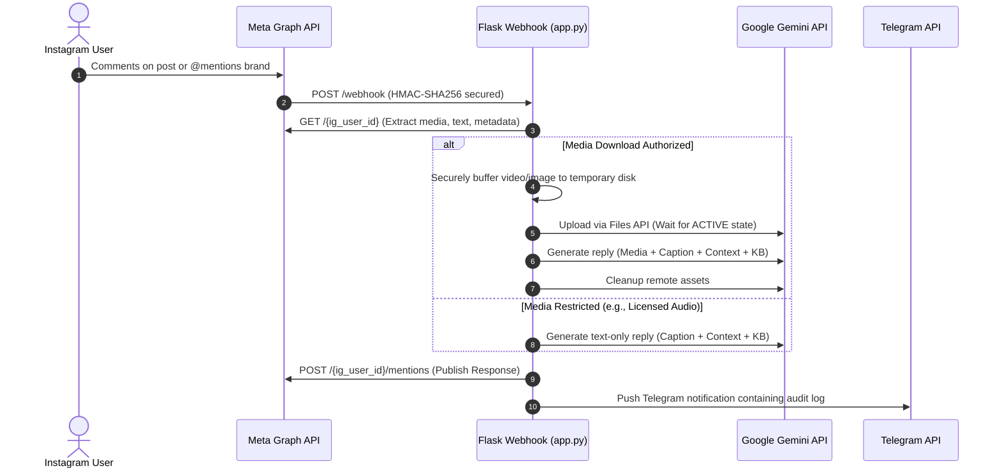

<div align="center">
  <h1>Refutation.app</h1>
  <p><strong>Intelligent Multimodal Instagram Mention & Comment Reply Automation</strong></p>

  <p>
    <a href="https://python.org/"></a>
    <a href="https://developers.facebook.com/"></a>
    <a href="https://aistudio.google.com/"></a>
    <a href="https://flask.palletsprojects.com/"></a>
  </p>
</div>

---

## Overview

**Refutation.app** is an enterprise-grade automation service that listens for `@mentions` and direct comments on your Instagram Business or Creator account. When triggered, the service automatically downloads the associated media (Reels, Videos, Carousels, Photos) and utilizes **Google Gemini's multimodal vision and audio engine** to contextualize the user's intent alongside your brand guidelines. 

The bot then drafts an authentic, context-aware reply, publishes it instantly via Instagram's official Graph API, and dispatches a realtime alert to your team via Telegram.

## Core Features

- **Multimodal Video & Audio Understanding**: Seamlessly processes video files, dialogue, gestures, and text overlays by uploading MP4/MOV assets directly to Google Gemini.
- **Direct Comments & Mentions Support**: Responds contextually whether the user tags your account in a third-party post, or comments directly on your own content.
- **Custom Knowledge Base**: Injects a highly customizable `knowledge_base.txt` into the LLM context to guarantee brand consistency and correct factual recall.
- **Graceful Error Handling & Fallbacks**: Automatically reverts to text-only analysis (caption + comment) if Meta restricts video downloads due to copyrighted audio policies.
- **Secure Webhook Verification**: Implements strict HMAC-SHA256 signature verification matching Meta's exact specifications to protect endpoints from unauthorized requests.
- **Realtime Telegram Alerts**: Instant push notifications detailing user interactions, generated replies, and quick links to the original posts.

---

## Architecture Workflow



---

## Getting Started

### Prerequisites

1. **Instagram Professional Account**: Must be configured as a Business or Creator account and linked to an administered Facebook Page.
2. **Meta Developer App**: A "Business" type app at [developers.facebook.com](https://developers.facebook.com) with the Instagram Graph API product configured.
3. **Google Gemini API Key**: Free API key from [Google AI Studio](https://aistudio.google.com/).
4. **Python 3.10+** environment.

### 1. Environment Configuration

Clone the repository and prepare your environment:

```bash
git clone https://github.com/AmmarFaizulHasan/Refutation.app.git
cd Refutation.app
python -m venv venv
source venv/bin/activate  # On Windows: venv\Scripts\activate
pip install -r requirements.txt
cp .env.example .env
```

Define the following parameters in your `.env` file:

| Variable | Description |
| :--- | :--- |
| `IG_USER_ID` | Your numeric Instagram Business Account ID. |
| `IG_ACCESS_TOKEN` | A Long-Lived Page Access Token with `instagram_manage_comments` permission. |
| `META_APP_SECRET` | App Secret found in Meta App Dashboard (used for HMAC verification). |
| `WEBHOOK_VERIFY_TOKEN` | Custom secure string configured in Meta Webhook Dashboard. |
| `GEMINI_API_KEY` | API Key generated from Google AI Studio. |
| `TELEGRAM_BOT_TOKEN` | Token provided by @BotFather (optional). |
| `TELEGRAM_CHAT_ID` | Numeric Chat ID for notifications (optional). |

### 2. Local Development & Testing

Start the application daemon and expose it securely via local tunnel (e.g., Localtunnel or Ngrok):

```bash
# Terminal 1: Start Flask Server
python app.py

# Terminal 2: Expose Webhook securely
npx localtunnel --port 8000 --subdomain my-brand-bot
```

### 3. Meta Webhook Registration

1. Navigate to the **Meta App Dashboard** → **Webhooks** → **Instagram**.
2. Update **Callback URL**: `https://my-brand-bot.loca.lt/webhook`
3. Enter your **Verify Token** (`WEBHOOK_VERIFY_TOKEN`).
4. Click **Verify and Save**.
5. Subscribe to the **`mentions`** and **`comments`** webhook fields.

---

## Why Google Gemini?

Unlike text-only LLM endpoints, the **Google Gemini API (`gemini-3.6-flash`)** natively supports asynchronous video processing. This allows the bot to ingest raw `.mp4` and `.mov` files, interpreting visual frame sequences, spoken dialogue, embedded text overlays, and gestures seamlessly—a crucial requirement for intelligently responding to complex Instagram Reels.

---

## Known Limitations

- **Copyrighted Audio**: Meta's Graph API redacts the `media_url` payload for Reels utilizing licensed, commercial tracks. The application will elegantly detect this state and route the request to a text-only generative fallback.
- **Instagram Stories**: The official Meta Graph API currently does not dispatch webhook events for mentions within 24-hour Stories.
- **Private Accounts**: Webhook payloads are intentionally suppressed by Meta when the triggering mention originates from a private user profile.

---

## Security

This application enforces mandatory `X-Hub-Signature-256` payload verification matching Meta's required specifications. For internal development and load testing, you may optionally configure `BYPASS_SIGNATURE_CHECK=1` to allow mock simulated payloads. Ensure this is explicitly disabled (`0` or removed) in production deployments.

---

<div align="center">
  <p>Designed and maintained by Ammar Faizul Hasan</p>
</div>
