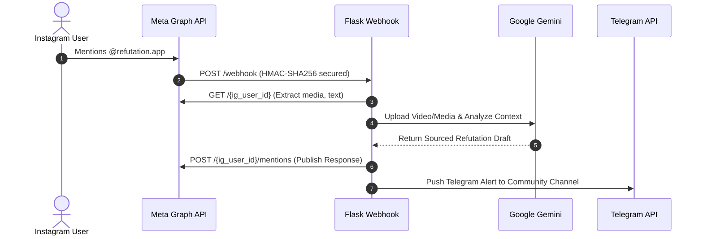

<div align="center">
  <h1>Refutation.app</h1>
  <p><strong>Standing for Islam. Standing for Truth. Standing for Humanity.</strong></p>
  <p><em>Hackathon Submission • Team Refutation.app</em></p>
  <p>
    <a href="https://python.org/"></a>
    <a href="https://developers.facebook.com/"></a>
    <a href="https://aistudio.google.com/"></a>
    <a href="https://flask.palletsprojects.com/"></a>
  </p>
</div>

---

## The Problem
Hate spreads faster than anyone can correct it.
- **Islamophobic content spreads unchecked**: False claims and mockery targeting Islam circulate freely across reels, posts, and comment threads.
- **Algorithms reward outrage**: Engagement-driven ranking gives inflammatory content a louder megaphone than measured correction.
- **Responses are scattered and buried**: Individual replies from concerned users get lost in the noise and rarely reach the top of a thread.
- **No organized counter-voice exists**: There is no systematic, sourced, community-backed way to push back at scale.

## The Insight
The comment section is the battleground.
Platforms rank comments by engagement, not by truth. When a calm, well-sourced refutation becomes the top comment, it reaches the exact audience the original post was trying to mislead — turning the post's own reach against its message.

* Top comment = first impression every viewer sees
* Organic likes outrun the algorithm's own signals
* One community can out-engage one bad actor

## The Solution
**Introducing Refutation.app**
An Instagram bot that, when tagged, reads the post it's replying to, drafts a respectful, Islamically-sourced refutation with Google Gemini, posts it directly, and rallies a community on Telegram to organically carry it to the top of the thread.

- **Tag & Trigger**: A single `@mention` in a comment starts the entire pipeline.
- **AI Analysis**: Gemini reads the post's caption, media, and comment context.
- **Sourced Refutation**: Replies are grounded in Qur'an, Hadith, and scholarship.
- **Community Boost**: Telegram alerts a network to organically like the reply.

---

## How It Works
**From tag to top comment:**
1. **Tag the bot**: A user mentions `@refutation.app` on islamophobic content.
2. **Webhook fires**: Meta's Graph API instantly notifies the backend.
3. **Gemini analyzes**: The post's media, caption, and comment are read together.
4. **Reply is drafted**: A concise, sourced, respectful refutation is generated.
5. **Bot replies**: The refutation is posted directly under the comment.
6. **Community rallies**: Telegram members get the link and organically like it.

---

## Responsible AI
Accurate, respectful, grounded.
- **Source-Grounded**: Every reply is anchored in established Qur'anic verses, authentic Hadith, and recognized scholarship — not the model's unaided opinion.
- **Calm by Design**: Prompts enforce a measured, non-inflammatory tone so replies persuade rather than provoke further conflict.
- **Concise & On-Platform**: Replies stay under 250 characters, fitting Instagram's comment format while remaining substantive.
- **Guardrails Against Error**: Structured prompting and scoped context reduce hallucination risk and keep responses on-topic.

## Amplification Model
**Turning community into reach.**
The bot doesn't fight alone. Every refutation is paired with a Telegram alert so real people — not bots — can organically push it to the top of the thread.
- **Instant Alert**: Post link + comment sent to a Telegram group the moment a reply is posted.
- **Real People Engage**: Community members read, verify, and like the refutation themselves.
- **Organic Signal**: Genuine engagement keeps the model platform-compliant.
- **Rises to the Top**: Like velocity outpaces the original post's own engagement on that comment.

---

## Technical Architecture



### Core Stack
- **Flask 3 + Gunicorn** — Webhook server
- **Meta Graph API v22** — Comments & replies
- **Google Gemini 3.6 Flash** — Multimodal reasoning
- **Telegram Bot API** — Community notifications
- **Render / VPS** — Always-on web hosting

### Why it's reliable:
- **Signed webhook handshake** verifies every request from Meta.
- **Long-lived (60-day) page tokens** keep the bot continuously connected.
- **Fast 200 OK responses** keep Meta's delivery pipeline healthy.

---

## Getting Started / Setup

### 1. Environment Configuration
Clone the repository and install dependencies:
```bash
git clone https://github.com/AmmarFaizulHasan/Refutation.app.git
cd Refutation.app
python -m venv venv
source venv/bin/activate
pip install -r requirements.txt
cp .env.example .env
```

Define the following parameters in your `.env` file:
- `IG_USER_ID`: Your numeric Instagram Business Account ID.
- `IG_ACCESS_TOKEN`: A Long-Lived Page Access Token.
- `META_APP_SECRET`: App Secret for HMAC verification.
- `WEBHOOK_VERIFY_TOKEN`: Custom secure string configured in Meta Dashboard.
- `GEMINI_API_KEY`: API Key from Google AI Studio.
- `TELEGRAM_BOT_TOKEN` & `TELEGRAM_CHAT_ID`: For community alerts.

### 2. Local Development
```bash
# Terminal 1: Start Flask Server
python app.py

# Terminal 2: Expose Webhook securely
npx localtunnel --port 8000 --subdomain refutation-bot
```
Update your Meta Webhook Callback URL to point to your secure tunnel.

---

## Impact & Vision
Every hateful post becomes an opportunity.
- Converts platform mechanics built for outrage into a vehicle for truth.
- Scales far beyond what any single moderator could do by hand.
- Points toward a distributed, community-powered counter-narrative model — for any misrepresented community, not only this one.

> "The goal isn't to silence a post — it's to make sure the first thing every viewer reads is the truth."

## Roadmap
- **Multi-Platform Expansion**: Bring the same pipeline to X, TikTok, and YouTube Shorts.
- **Multilingual Replies**: Generate refutations in the commenter's own language.
- **In-Reply Citations**: Link directly to the Qur'anic verse or Hadith referenced.
- **Severity Scoring**: Score context before auto-replying, to prioritize the worst offenders.
- **Moderation Dashboard**: Give admins visibility into every reply and its outcomes.
- **Community Leaderboard**: Recognize the most active, effective community contributors.

---
<div align="center">
  <p>Join the movement. Be part of the solution. Help make the internet a better place.</p>
</div>
